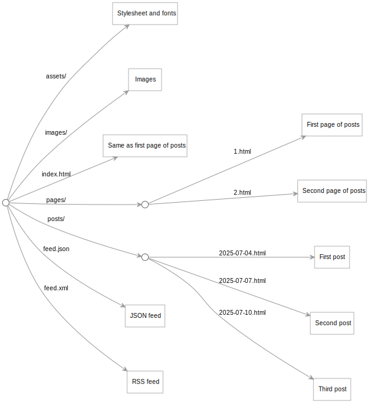

This project offers you a starting point for building a blog in the [Origami](https://weborigami.org) language.

You can view a [sample blog](https://pondlife.netlify.app) built from this starting point.

## Creating your own blog

If you'd like to use this project as a starting point for a blog, fork the project. (On GitHub: click the Fork button.)

After forking, edit the `siteInfo.yaml` file in the `src` folder to provide some basic details for the blog.

## Running the blog

Install Origami and the project's other dependencies by running the following command in a terminal window:

```console
$ npm install
```

You can then start the Origami server with:

```console
$ npm run start
```

## Adding posts

To add a new post, create a file in the `markdown` folder. Give this file a name that includes the post's date in YYYY-MM-DD format. Example: if you're writing the post on December 7, 2025, call the file `2025-12-07.md`.

Include a block at the top of the post like this to set the post's title:

```md
---
title: Title goes here
---
```

## Building the blog as static files

You can build the blog as a folder of static files:

```console
$ npm run build
```

This will create a `build` folder with all the files for the site.

## Structure of the site

The `src` folder contains the Origami program that makes the blog work. The main file is [site.ori](src/site.ori), which orchestrates the construction of the site:



- Each blog post starts as a markdown file in the `markdown` folder.
- A series of transformations turns each post into an HTML page in the `posts` area.
- Posts are grouped into pages of 10 posts each in the `pages` area.
- The index page shows the same content as `pages/1.html`.
- Feeds are created for the posts in RSS and JSON Feed format.

The [source for a sample blog created from this project](https://github.com/WebOrigami/pondlife) contains additional details about how the blog program works.
